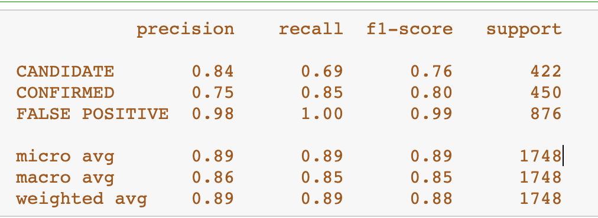
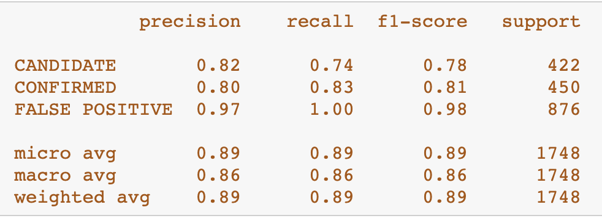

# Exoplanet Exploration

## Background

Over a period of nine years in deep space, the NASA Kepler space telescope has been out on a planet-hunting mission to discover hidden planets outside of our solar system.

## Task
Create machine learning models capable of classifying candidate exoplanets from the raw dataset.

## Process

### Preprocess the Data

* Preprocessed the dataset prior to fitting the model.
* Performed feature selection and remove unnecessary features.
* Used `MinMaxScaler` to scale the numerical data.
* Separated the data into training and testing data.

### Tune Model Parameters

* Used `GridSearch` to tune model parameters.
* Tune and compare different classifiers like Logistic Regression, K-Nearest Neighbours, Support Vector Machine, Random Forest Classifier.

# Conclusion
### After comparing all the models, it looks like Random Forest Classifier gives the best Accuracy Score.

### Logistic Regression Score
* Training Data Score: 0.8411214953271028
* Testing Data Score: 0.8409610983981693

### KNN Score without Gridsearch
* Training Data Score: 0.8725920274651917
* Testing Data Score: 0.8249427917620137

### KNN Score with Gridsearch
* Training Data Score: 0.8725920274651917
* Testing Data Score: 0.8249427917620137

### SVM without Gridsearch
* Training Data Score: 0.8439824527942018
* Testing Data Score: 0.8415331807780321

### SVM with Gridsearch
* Training Data Score: 0.8901392332633988
* Testing Data Score: 0.8861556064073226

### SVM Classification Report

### Random Forest Classifier Score without Gridsearch
* Training Data Score: 0.996185390043868
* Testing Data Score: 0.8729977116704806

### Random Forest Classifier Score with Gridsearch
* Training Data Score: 1.0
* Testing Data Score: 0.8907322654462243

### Random Forest Classification report

- - -

## Resources

* [Exoplanet Data Source](https://www.kaggle.com/nasa/kepler-exoplanet-search-results)

* [Scikit-Learn Tutorial Part 1](https://www.youtube.com/watch?v=4PXAztQtoTg)

* [Scikit-Learn Tutorial Part 2](https://www.youtube.com/watch?v=gK43gtGh49o&t=5858s)

* [Grid Search](https://scikit-learn.org/stable/modules/grid_search.html)

